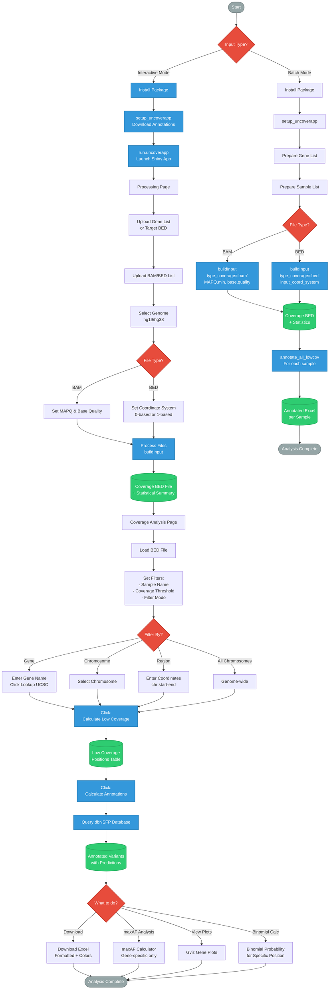

# uncoverappLib Workflow

```mermaid
flowchart TD
    Start([Start]) --> Choice{Input Type?}
    
    %% Branch 1: Interactive Mode
    Choice -->|Interactive Mode| Install[Install Package]
    Install --> Setup[setup_uncoverapp<br/>Download Annotations]
    Setup --> Launch[run.uncoverapp<br/>Launch Shiny App]
    
    Launch --> PrepPage[Processing Page]
    PrepPage --> UploadGenes[Upload Gene List<br/>or Target BED]
    UploadGenes --> UploadData[Upload BAM/BED List]
    UploadData --> SelectGenome[Select Genome<br/>hg19/hg38]
    SelectGenome --> SelectType{File Type?}
    
    SelectType -->|BAM| SetBAMParams[Set MAPQ & Base Quality]
    SelectType -->|BED| SetBEDParams[Set Coordinate System<br/>0-based or 1-based]
    
    SetBAMParams --> Process[Process Files<br/>buildInput]
    SetBEDParams --> Process
    
    Process --> BEDOutput[(Coverage BED File<br/>+ Statistical Summary)]
    
    BEDOutput --> CovPage[Coverage Analysis Page]
    CovPage --> LoadBED[Load BED File]
    LoadBED --> SetFilters[Set Filters:<br/>- Sample Name<br/>- Coverage Threshold<br/>- Filter Mode]
    
    SetFilters --> FilterMode{Filter By?}
    FilterMode -->|Gene| GeneFilter[Enter Gene Name<br/>Click Lookup UCSC]
    FilterMode -->|Chromosome| ChrFilter[Select Chromosome]
    FilterMode -->|Region| RegionFilter[Enter Coordinates<br/>chr:start-end]
    FilterMode -->|All Chromosomes| AllFilter[Genome-wide]
    
    GeneFilter --> CalcLow[Click:<br/>Calculate Low Coverage]
    ChrFilter --> CalcLow
    RegionFilter --> CalcLow
    AllFilter --> CalcLow
    
    CalcLow --> LowCovResults[(Low Coverage<br/>Positions Table)]
    
    LowCovResults --> CalcAnnot[Click:<br/>Calculate Annotations]
    CalcAnnot --> QueryDB[Query dbNSFP Database]
    QueryDB --> AnnotResults[(Annotated Variants<br/>with Predictions)]
    
    AnnotResults --> Explore{What to do?}
    
    Explore -->|Download| DownloadExcel[Download Excel<br/>Formatted + Colors]
    Explore -->|maxAF Analysis| MaxAF[maxAF Calculator<br/>Gene-specific only]
    Explore -->|View Plots| Plots[Gviz Gene Plots]
    Explore -->|Binomial Calc| Binomial[Binomial Probability<br/>for Specific Position]
    
    %% Branch 2: Batch Mode
    Choice -->|Batch Mode| BatchInstall[Install Package]
    BatchInstall --> BatchSetup[setup_uncoverapp]
    BatchSetup --> BatchGenes[Prepare Gene List]
    BatchGenes --> BatchSamples[Prepare Sample List]
    BatchSamples --> BatchType{File Type?}
    
    BatchType -->|BAM| BatchBAM[buildInput<br/>type_coverage='bam'<br/>MAPQ.min, base.quality]
    BatchType -->|BED| BatchBED[buildInput<br/>type_coverage='bed'<br/>input_coord_system]
    
    BatchBAM --> BatchOutput[(Coverage BED<br/>+ Statistics)]
    BatchBED --> BatchOutput
    
    BatchOutput --> BatchAnnot[annotate_all_lowcov<br/>For each sample]
    BatchAnnot --> BatchResults[(Annotated Excel<br/>per Sample)]
    
    BatchResults --> BatchDone([Analysis Complete])
    
    DownloadExcel --> Done([Analysis Complete])
    MaxAF --> Done
    Plots --> Done
    Binomial --> Done
    
    %% Styling
    classDef processStyle fill:#3498DB,stroke:#2980B9,stroke-width:2px,color:#fff
    classDef dataStyle fill:#2ECC71,stroke:#27AE60,stroke-width:2px,color:#fff
    classDef decisionStyle fill:#E74C3C,stroke:#C0392B,stroke-width:2px,color:#fff
    classDef endStyle fill:#95A5A6,stroke:#7F8C8D,stroke-width:2px,color:#fff
    
    class Install,Setup,Launch,Process,CalcLow,CalcAnnot,QueryDB,BatchBAM,BatchBED,BatchAnnot processStyle
    class BEDOutput,LowCovResults,AnnotResults,BatchOutput,BatchResults dataStyle
    class Choice,SelectType,FilterMode,Explore,BatchType decisionStyle
    class Start,Done,BatchDone endStyle
```