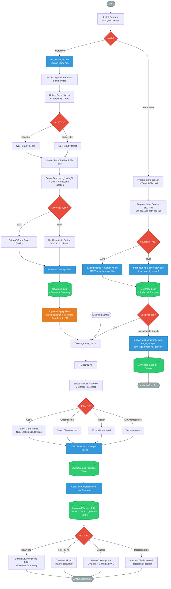

# uncoverappLib Workflow

```mermaid
flowchart TD
    Start([Start]) --> InstallSetup[Install Package<br/>setup_uncoverapp]

    InstallSetup --> Choice{Mode?}

    %% ── INTERACTIVE ──────────────────────────────────────
    Choice -->|Interactive| Launch[uncoverappLib.run<br/>Launch Shiny App]

    Launch --> PrepPage[Processing and Statistical Summary tab]
    PrepPage --> UploadTarget[Upload Gene List .txt<br/>or Target BED .bed]
    UploadTarget --> InputType{Input Type?}
    InputType -->|Gene list| GeneInput[type_input = genes]
    InputType -->|Target BED| TargetInput[type_input = target]
    GeneInput --> UploadData[Upload .list of BAM or BED files]
    TargetInput --> UploadData

    UploadData --> SelectGenome[Select Genome hg19 / hg38<br/>Select Chromosome Notation]
    SelectGenome --> CovType{Coverage Type?}
    CovType -->|BAM| SetBAM[Set MAPQ and Base Quality]
    CovType -->|BED| SetBED[Set Coordinate System<br/>0-based or 1-based]
    SetBAM --> Process[Process Coverage Files]
    SetBED --> Process

    Process --> BEDOutput[(Coverage BED<br/>+ Statistical Summary)]
    BEDOutput --> OptFilter[Optional: Apply Filter<br/>Select samples + threshold<br/>Download XLSX]
    OptFilter --> CovPage

    ExtBED([External BED file]) --> CovPage
    CovPage[Coverage Analysis tab] --> LoadBED[Load BED File]

    LoadBED --> SetParams[Select Sample, Genome,<br/>Coverage Threshold]
    SetParams --> FilterMode{Filter By?}
    FilterMode -->|Gene| GeneFilter[Enter Gene Name<br/>Click Lookup UCSC Gene]
    FilterMode -->|Chromosome| ChrFilter[Select Chromosome]
    FilterMode -->|Region| RegionFilter[Enter chr:start-end]
    FilterMode -->|All Chromosomes| AllFilter[Genome-wide]

    GeneFilter --> CalcLow[Calculate Low Coverage Regions]
    ChrFilter --> CalcLow
    RegionFilter --> CalcLow
    AllFilter --> CalcLow

    CalcLow --> LowCovResults[(Low Coverage Positions Table)]
    LowCovResults --> CalcAnnot[Calculate Annotations on Low Coverage]
    CalcAnnot --> AnnotResults[(Annotated Variants Table<br/>ClinVar · CADD · gnomAD · OMIM)]

    AnnotResults --> Explore{Next step?}
    Explore -->|Download| DownloadExcel[Download Annotations XLSX<br/>with colour formatting]
    Explore -->|Filter by AF| MaxAF[Calculate AF tab<br/>maxAF calculator]
    Explore -->|Visualise| Plots[Gene Coverage tab<br/>Gviz plot + Download PNG]
    Explore -->|Detection prob| Binomial[Binomial Distribution tab<br/>P detection at position]

    DownloadExcel --> Done([Analysis Complete])
    MaxAF --> Done
    Plots --> Done
    Binomial --> Done

    %% ── BATCH / STANDALONE ───────────────────────────────
    Choice -->|Standalone| BatchGenes[Prepare Gene List .txt<br/>or Target BED .bed]
    BatchGenes --> BatchSamples[Prepare .list of BAM or BED files<br/>one absolute path per line]
    BatchSamples --> BatchType{Coverage Type?}
    BatchType -->|BAM| BatchBAM["buildInput(type_coverage='bam'<br/>MAPQ.min, base.quality)"]
    BatchType -->|BED| BatchBED["buildInput(type_coverage='bed'<br/>input_coord_system)"]
    BatchBAM --> BatchOutput[(Coverage BED<br/>+ Statistical Summary)]
    BatchBED --> BatchOutput

    BatchOutput --> CanLoadApp{Load into app?}
    CanLoadApp -->|Yes| CovPage
    CanLoadApp -->|No, annotate directly| BatchAnnot["buildAnnotation(sample_data, target_sample,<br/>coverage_threshold, genome)"]
    BatchAnnot --> BatchResults[(Annotated Excel per Sample)]
    BatchResults --> BatchDone([Analysis Complete])

    %% ── STYLING ──────────────────────────────────────────
    classDef processStyle fill:#3498DB,stroke:#2980B9,stroke-width:2px,color:#fff
    classDef dataStyle fill:#2ECC71,stroke:#27AE60,stroke-width:2px,color:#fff
    classDef decisionStyle fill:#E74C3C,stroke:#C0392B,stroke-width:2px,color:#fff
    classDef endStyle fill:#95A5A6,stroke:#7F8C8D,stroke-width:2px,color:#fff
    classDef optStyle fill:#E67E22,stroke:#D35400,stroke-width:2px,color:#fff

    class Launch,Process,CalcLow,CalcAnnot,BatchBAM,BatchBED,BatchAnnot processStyle
    class BEDOutput,LowCovResults,AnnotResults,BatchOutput,BatchResults dataStyle
    class Choice,CovType,FilterMode,Explore,BatchType,InputType,CanLoadApp decisionStyle
    class Start,Done,BatchDone endStyle
    class OptFilter optStyle
```